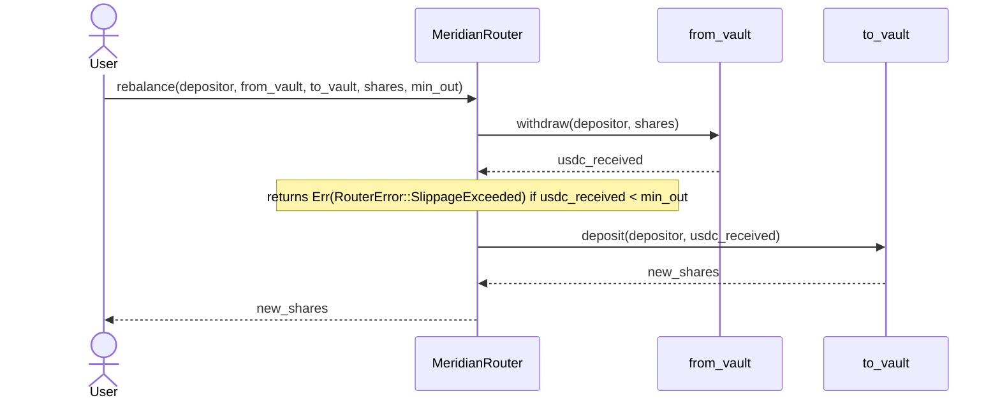

# Contracts

Meridian ships two Soroban contracts: a **vault** that holds user USDC and mints
share tokens, and a **router** that moves a user's position between vaults in a
single atomic transaction.

Both contracts live under `packages/contracts/` and are built with the same
Stellar CLI (`stellar contract build`). The deploy script at
`scripts/deploy-testnet.sh` builds, uploads, and deploys both.

## Vault (`meridian-vault`)

Source: [`packages/contracts/vault/src/lib.rs`](../packages/contracts/vault/src/lib.rs)

The vault is a protocol-agnostic coordinator, not a direct protocol integration:
it holds no opinion about where funds actually earn yield and delegates all
protocol-specific work to a swappable **adapter** contract (`BlendAdapter` or
`DefindexAdapter`), selected via `set_adapter`. Users deposit USDC and receive
mUSDC share tokens whose redemption value grows with yield accrued in the
active adapter's underlying protocol.

A virtual share/asset offset of 1 000 stroops is applied to all price
calculations to neutralise the first-depositor inflation attack: an attacker
who donates USDC directly to the adapter recovers only a negligible fraction of
the donation, making the skim unprofitable.

There is no `route_to` or protocol-selection parameter on `deposit` — which
protocol funds reach is determined entirely by whichever adapter the vault
currently has set, not by anything the caller passes in. Which vault _instance_
(and therefore which adapter) a deposit targets is chosen off-chain, by
resolving the `vaultId` to a specific deployed vault contract address.

For the full entry-point reference, error codes, and storage layout, see
[`apps/docs/architecture/vault-contract.md`](../apps/docs/architecture/vault-contract.md) —
that page is the canonical, detailed reference; this page covers the router
below.

## Router (`meridian-router`)

Source: [`packages/contracts/router/src/lib.rs`](../packages/contracts/router/src/lib.rs)

The router provides a single `rebalance` entry point that moves a user's entire
position from one Meridian vault to another inside one Soroban transaction. If
any step fails, Soroban rolls back the entire transaction, so the user's
position is never partially migrated.

### How `rebalance` works



USDC flows through the depositor's account, not the router. After `withdraw`,
the USDC lands in the depositor's account. `deposit` then pulls it straight
into `to_vault`. The router never holds tokens.

### Entry point

```rust
pub fn rebalance(
    env: Env,
    depositor: Address,
    from_vault: Address,
    to_vault: Address,
    shares: i128,
    min_out: i128,
) -> Result<i128, RouterError>
```

| Parameter    | Description                                                           |
| ------------ | --------------------------------------------------------------------- |
| `depositor`  | Address whose shares are burned. Must authorise this call.            |
| `from_vault` | Vault contract to withdraw from.                                      |
| `to_vault`   | Vault contract to deposit into.                                       |
| `shares`     | mUSDC share count to burn on `from_vault`.                            |
| `min_out`    | Minimum USDC stroops the withdrawal must return. Reverts on slippage. |

Returns the number of shares minted by `to_vault`, or `RouterError::SlippageExceeded`
if the withdrawal from `from_vault` returned fewer stroops than `min_out`, or
`RouterError::VaultNotAllowed` if `from_vault` or `to_vault` isn't on the
router's admin-managed allowlist (see below).

### Admin and the vault allowlist

The router has its own admin, set once via `initialize(admin)` and independent
of any vault's admin. `add_vault`/`remove_vault` (admin-only) control which
addresses `rebalance` will accept as `from_vault`/`to_vault`; `is_allowed_vault`
is a public read. This exists so a depositor signing `rebalance` can't be
routed into an attacker-controlled contract masquerading as a vault, since
`rebalance` would otherwise call `withdraw`/`deposit` on whatever address it's
given with no validation. `scripts/deploy-testnet.sh` initializes the router
and allowlists the vault it deploys automatically; a router managing multiple
vaults needs `add_vault` called for each one. `set_admin` rotates the admin key,
so a lost or compromised one doesn't permanently freeze the allowlist.

`rebalance` also rejects `from_vault == to_vault` with `RouterError::SameVault`,
a same-vault call can't move funds anywhere an attacker controls (the depositor
signs it themselves), but it's a pointless round trip that could shift the
depositor's own position via adapter rounding for no reason.

### Auth model

The depositor signs one transaction that covers the full call tree. Soroban's
hierarchical auth model propagates the signature to the `withdraw` and `deposit`
sub-invocations automatically. The `simulate_transaction` RPC call returns the
complete set of `SorobanAuthorizationEntry` objects the client must attach before
signing, so no special handling is needed in the frontend beyond the standard
`signTransaction` call already used for single-vault operations (see
[`docs/signing-flow.md`](signing-flow.md)).

### Slippage protection

`min_out` is a floor on the USDC the `from_vault` withdrawal must return. Pass
`1` to disable the check (accept any non-zero amount). The caller should compute
a sensible value by multiplying the current share redemption rate by
`(1 - slippage_tolerance)` and converting to stroops.

## Building and deploying

```bash
# Build both contracts
cd packages/contracts
stellar contract build

# Deploy to testnet (requires DEPLOYER env var set to a funded secret key)
bash scripts/deploy-testnet.sh
```

The deploy script prints the deployed contract IDs. Add them to `.env` as
`VAULT_CONTRACT_ID` and `ROUTER_CONTRACT_ID`.
